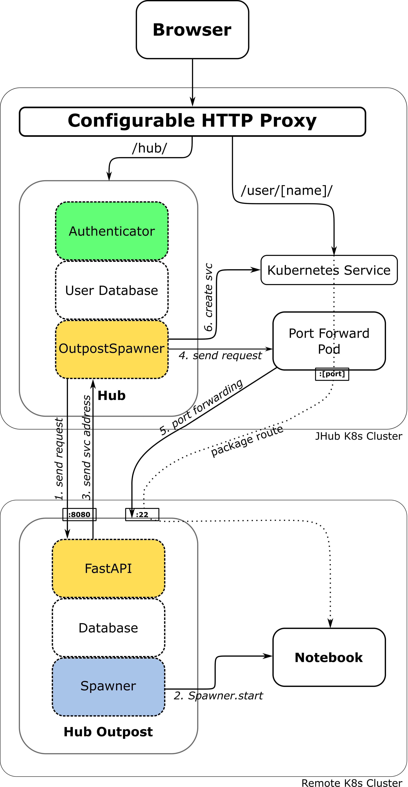

# Architecture

## Default

This is the default architecture of a single-user start. The packages between user and single-user server will be tunneled through the hub container. 

Cf. [here](https://jupyterhub.readthedocs.io/en/latest/reference/technical-overview.html#the-major-subsystems-hub-proxy-single-user-notebook-server)

### 1. Send Request
The OutpostSpawner collects all information relevant for the start of a single-user server. In general these are `name`, `environment` and selected `user_options`. Optional information like `certificates` or `trust_bundles` (in case of `internal_ssl`) are send to the JupyterHub Outpost if necessary.  

### 2. Spawner.start
The JupyterHub Outpost will use the configured JupyterHub Spawner, to start the single-user server. It uses the same functions JupyterHub would use during a start process (`run_pre_spawn_hook`, `move_certs`, `start`). Events generated by `_generate_progress()` will be send to JupyterHub, so users will not miss any important information. 

### 3. Send service address
JupyterHub will need the service address to create the SSH port forwarding. 

### 4. Port forwarding
JupyterHub uses a random available port to forward traffic for this single-user server to the JupyterHub Outpost. It uses SSH multiplexing to reduce the number of connections. Simplified port forward command: `ssh -L 0.0.0.0:[random_port]:[service_address]:[single-user_port] jupyterhuboutpost@[outpost-ip]`.  
It's also possible to define a customized port forward function (e.g. to outsource port-forwarding to an external pod). 

### 5. Create service
At this step JupyterHub OutpostSpawner will create a Kubernetes Service, allowing the Configurable HTTP Proxy to communicate with the single-user server. In the default configuration the Hub pod itself is targeted by the Kubernetes service. All packages between the client and the single-user server will be forwarded through the hub container. It's also possible to alter the Kubernetes service selector, or to define a customized service creation function (e.g. to outsource port-forwarding to an external pod).

## External Tunneling

In this scenario an additional pod was created to manage the port forwarding. Single-user server are reachable, even if JupyterHub itself is currently offline.

Cf. [here](https://jupyterhub.readthedocs.io/en/latest/reference/technical-overview.html#the-major-subsystems-hub-proxy-single-user-notebook-server)

## Delayed Tunneling

This shows a single-user start on an external system, if the service address of the single-user server is not determined during the start process. This may be the case if you have configured a Spawner, which spawns single-user server on remote Batch systems. The single-user server itself has to contact the [OutpostSpawner](https://jupyterhub-outpostspawner.readthedocs.io/en/latest/apiendpoints.html) itself, once its location is settled.

Cf. [here](https://jupyterhub.readthedocs.io/en/latest/reference/technical-overview.html#the-major-subsystems-hub-proxy-single-user-notebook-server)
